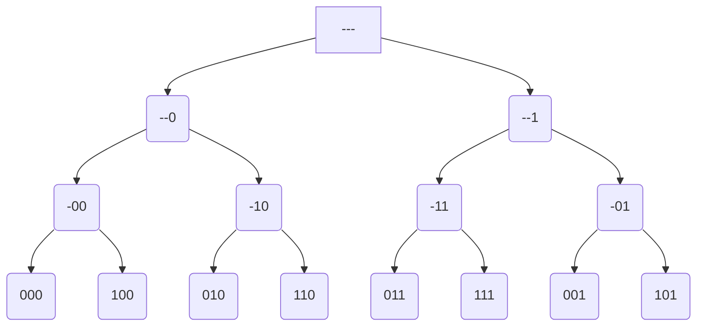

# Backtracking

## k-ary Binary Strings

Given an input `n`, print all possible binary strings of length `n`.

Input: `1`  
Output: `0 1`

Input: `2`  
Output: `00 01 10 11`

Input: `3`  
Output: `000 001 010 011 100 101 110 111`

From above series of inputs, we can predict that the time complexity is `O(2^n)`.



```c
#include<stdio.h>

void recur(char arr[], long n){
    if(n == 0){
        printf("%s ", arr);
        return;
    }
    arr[n-1] = '0'; // try all possible combinations with 0
    recur(arr, n-1);
    arr[n-1] = '1'; // try all possible combinations with 1
    recur(arr, n-1);
}

int main(){
    long n;
    scanf("%ld", &n);
    char arr[n];
    recur(arr, n);
    return 0;
}
```
