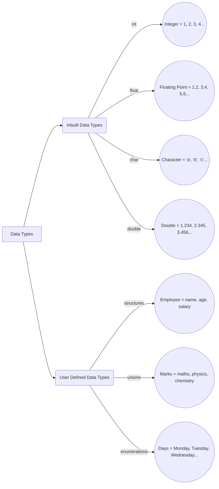

# Daat Structures

## Data types

There are two types of data types in C:
1. Inbuilt data types (int, float, char, double, etc.)
2. User defined data types (structures, unions, enumerations)

```mermaid  
graph LR
A[Data Types] --> B(Inbuilt Data Types)
A --> C(User Defined Data Types)
B -->|int| D((Integer = 1, 2, 3, 4...))
B -->|float| E((Floating Point = 1.2, 3.4, 5.6...))
B -->|char| F((Character = 'a', 'b', 'c'...))
B -->|double| G((Double = 1.234, 2.345, 3.456...))
C -->|structures| H((Employee = name, age, salary))
C -->|unions| I((Marks = maths, physics, chemistry))
C -->|enumerations| J((Days = Monday, Tuesday, Wednesday...))
```

