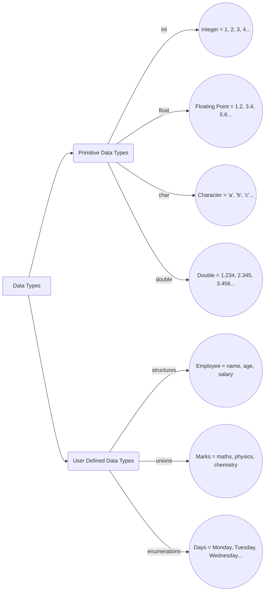
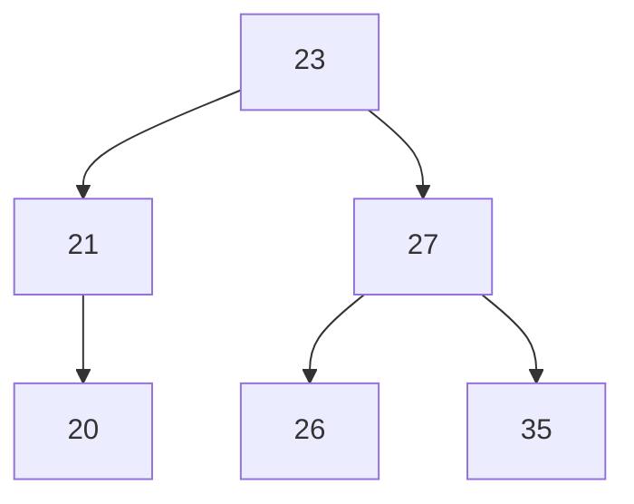

# Data Structures

## Data types

There are two types of data types in C:
1. Primitive data types (int, float, char, double, etc.)
2. User defined data types (structures, unions, enumerations)



## Structures
A structure is a user-defined data type in C that groups together related data of different data types. It allows us to create a more complex data type that can be used to represent a real-world entity.

### Structure Declaration
The general syntax for declaring a structure is:

```c
struct structureName {
    dataType member1;
    dataType member2;
    ...
    dataType memberN;
};
```

Example:

```c
#include <stdio.h>

struct CSD{ // Abstract Structure
    int id;
    char grade;  // char grade = 'A'; will give error
    double percentage;
};

int main(){
    ....
}
```

> - We cannot declare the values of the structure in the structure declaration.  
> - We can only declare the structure in the structure declaration.  
> - To declare the values of the structure, we need to create variables of that structure type.

**Abstraction**: Displaying only essential information and hiding the details.

**Encapsulation**: Putting group of data together and hiding that information by using access modifiers.
<br>
<br>


Providing values to the structure:

```c
#include <stdio.h>

struct CSD{ // Abstract Structure
    int id;
    char grade;  // char grade = 'A'; will give error
    double percentage;
};

struct CSD setStudent(int i, char g, double p){
    struct CSD o;   // Creating an object of structure type
    o.id = i;
    o.grade = g;
    o.percentage = p;
    return o;
};

void printStudent(struct CSD o){
    printf("ID: %d\n", o.id);
    printf("Grade: %c\n", o.grade);
    printf("Percentage: %lf\n", o.percentage);
}

int main(){
    struct CSD std1, std2; // Creating variables of structure type
    std1 = setStudent(23, 'A', 99.8);
    std2 = setStudent(24, 'B', 88.9);
    printStudent(std1);
    printStudent(std2);
    return 0;
}
```

#### Lecturer's code:

```c
#include <stdio.h>
//abstraction
struct CSD{// abstract structure
    int id; char grade; double per;
};
struct CSD setStudent(int i, char g, double p)
{ struct CSD o; o.id=i;  o.grade = g; o.per = p; return o; }
void printStudent(struct CSD o)
{ printf("ID: %d Grade: %c Percentage: %lf\n", o.id, o.grade, o.per); }
int main(){
    struct CSD std1, std2;
    std1 = setStudent(523, 'A', 99.8);
    std2 = setStudent(568, 'B', 88.9);
    printStudent(std1); printStudent(std2);
}
```

Smaller code:

```c
#include <stdio.h>

struct CSD{ // Abstract Structure
    int id;
    char grade;
    double percentage;
};

int main(){
    struct CSD std1, std2;
    std1.grade = 'A';
    printf("Grade: %c\n", std2.grade);  // Doesn't give error but gives garbage value
    // assiginig values to the structure 1 doesn't affect the structure 2
    return 0;
}
```


### Strucure Rules

1. We cannot perform initialization within the structure declaration.
2. Each object has its own state and behavior.
3. An object created within structure defaults to 0, else to garbage.
   
```c
#include <stdio.h>

struct CSD{ // Abstract Structure
    int id;
    char grade;
    double percentage;
}std1, std2; // Creating variables/Objects of structure type

int main(){
    std1.id = 90;
    printf("%d", std2.id);
}
```
> OUTPUT:
```
 0
```

Object created within structure declaration defaults to 0.  
Char will be deafulted to space.

- It is preferable to declare the structure outside the main function.

### Structure Array

```c
#include <stdio.h>
#include <string.h>

struct CSD{
    int id;
    char grade;
    double percentage;
};

struct CSD setStudent(int i, char g, double p){
    struct CSD o;
    o.id = i;
    o.grade = g;
    o.percentage = p;
    return o;
};

void printStudent(struct CSD o){
    printf("ID: %d\n", o.id);
    printf("Grade: %c\n", o.grade);
    printf("Percentage: %lf\n", o.percentage);
}

int main(){
    int n, i;
    printf("Enter the number of students: ");
    scanf("%d", &n);
    struct CSD std[n];
    for(i = 0; i < n; i++){
        printf("Enter %d student's ID, Grade, Percentage: ", i);
        scanf("%d %c %lf", &std[i].id, &std[i].grade, &std[i].percentage);
    }
    puts("Student Details: \n");
    for(i = 0; i < n; i++){
        printStudent(std[i]);
        printf("\n");
    }
    return 0;
}
```
> *OUTPUT*:
```
Enter the number of students: 2
Enter 0 student's ID, Grade, Percentage: 123 A 96
Enter 1 student's ID, Grade, Percentage: 321 Z 0.0002
Student Details:

ID: 123
Grade: A
Percentage: 96.000000

ID: 321
Grade: Z
Percentage: 0.000200
```

## Unions
A union is a user-defined data type that allows storing different data types in the same memory location. Only one member of the union can be accessed at a time.

### Union Properties

- A union can have multiple members, but only one member can contain a value at any given time.
- If the value of one member is changed, then the values of all other members will be changed.
- All members of a union share the same memory location.

### Union Declaration

The general syntax for declaring a union is:

```c
union unionName {
    dataType member1;
    dataType member2;
    ...
    dataType memberN;
};
```

Example:

```c
#include <stdio.h>
// Union Declaration
union CSD{
    int year1, year2, year3;
    // int year1 = 2000; will give error
    // Union is also an abstract data type like structure
}std1;

int main(){
    std1.year1 = 2024;
    printf("%d", std1.year2);  // Gives output 2024

    std1.year1 = 2024;
    std1.year3 = 2025;
    printf("%d %d %d", std1.year1, std1.year2, std1.year3);  
    // Gives output 2025 2025 2025
    return 0;
}
```
> All variables in CSD share the same address

<b>*OUTPUT*</b>:
```
2024
2025 2025 2025
```

### Union Rules

1. We cannot perform initialization within the union declaration.
2. All variables in a union share the same address.


## Enumerations

An enumeration is a user-defined data type that consists of integral constants. To define an enumeration, keyword enum is used.

### Enumeration Declaration
The basic syntax for declaring an enumeration is:

```c
enum enumName {
    constant1,
    constant2,
    ...
    constantN;
};
```

Example:
    
```c
#include <stdio.h>
// Enumerations
enum week{
    Monday,
    Tuesday,
    Wednesday,
    Thursday,
    Friday,
    Saturday,
    Sunday
};
// week ⇒ enumeration
// monday, tuesday ⇒ enumerators
// monday = 0, tuesday = 1 ⇒ values
int main(){
    enum week today;
    today = Wednesday;
    printf("Day %d", today+1);
    return 0;
}
```

> *OUTPUT*:
```
Day 3
```

If value of enum is predefined, then we can use it directly.

```c
#include <stdio.h>

enum week{
    Monday = 90, Tuesday
};

int main(){
    printf("%d %d", Monday, Tuesday);
    return 0;
}
```

> *OUTPUT*:
```
90 91
```

The value next to the previous value is automatically incremented by 1.

- Once the value of an enumerator is defined, it cannot be changed.
- If we don't assign values to enum names, then they are automatically assigned values starting from 0.

### Enumeration Rules

1. Object is not required to access the enum values.
2. First enum value is assigned 0, and then the next value is incremented by 1 by default.
3. If we don't assign values to enum names, then they are automatically assigned values starting from 0.
4. An enumerator's value is previous enumerator's value + 1.
5. Enumerators can be initialized to values of any integer type but cannot be changed outside the enum declaration. Enumerators are CONSTANTS.


## Insertion Before Algorithm

insertBefore(k1, k2) ⇒ Insert k2 before k1

1. If list is empty, Do nothing
2. If k1 is the head, push(k2)
3. Search for Node before k1(p)
    3a. If k1 does not exist ⇒ Do nothing
    3b1. Create a node, insert a value k2
    3b2. n next is k1(p→next)
    3b3. p next is n

## Insertion After Algorithm

insertAfter(k1, k2) ⇒ Insert k2 after k1

1. If list is empty, Do nothing
2. If k1 is the tail, append(k2)
3. Search for Node k1(p)
    3a. If k1 does not exist ⇒ Do nothing
    3b1. Create a node, insert a value k2
    3b2. n next is k1(p→next)
    3b3. p next is n

## Deletion Algorithm

1. If list is empty, Do nothing.
2. If head is N ⇒ head's next is new head.
3. If N is both head and tail ⇒ head and tail is NULL.
4. Search for N's previous node (p)  
    4a. If N does not exist ⇒ Do nothing.  
    4b. If p next is Tail ⇒ make p as new tail.  
    4c. If N is present, p's next is p's next's next.


# Stack

Stack is an ADT(abstract data type) that stores items in the order of Last-In/First-Out (LIFO) or First-In/Last-Out (FILO) manner.

## Stack Terminologies

Top ⇒ The topmost element of the stack.
Size ⇒ The number of elements in the stack.
Capacity ⇒ The maximum number of elements that can be stored in the stack.
Overflow ⇒ If we try to push an element into a full stack, then it is called an overflow condition.
Underflow ⇒ If we try to pop an element from an empty stack, then it is called an underflow condition.

## Stack Operations

Main operations:
    1. Push ⇒ Insert an item at the top of the stack.   || O(1)
    2. Pop ⇒ Remove an item from the top of the stack.  || O(1)

Auxiliary operations:
    1. isEmpty ⇒ Check if the stack is empty.   || O(1)
    2. isFull ⇒ Check if the stack is full.     || O(1)
    3. front ⇒ Get the value of the top element without removing it.    || O(1)
    4. getNth ⇒ Get the value of the nth element from the top.  || O(n)

## Stack Applications

1. Evaluation of an equation.
2. Reversing a string.
3. Undo/Redo.
4. Backtracking.
5. Function calls.
6. Parenthesis matching.
7. Infix to Postfix conversion.

## Stack Implementation

1. Array Implementation
2. Linked List Implementation


```c
#include <stdio.h>
#include <stdlib.h>

struct Stack{
    int data;
    struct Stack *next;
} *top = NULL;

void push(int v){
    struct Stack *n = (struct Stack *)malloc(sizeof(struct Stack)); // 1. Create a node
    n->data = v;    // 2. Insert a value
    n->next = top;  // 3. n next is top
    top = n;        // 4. top is n
}

int pop(){
    struct Stack *t = top;  // 1. Create a temp node
    top = top->next;        // 2. top's next is new top
    int d = t->data;        // 3. d is t's data
    free(t);                // 4. Delete t
    return d;
}

int isEmpty(){
    if(top == NULL)
        return 1;
    else
        return 0;
}

int main(){
    int n;
    printf("Enter the number of elements: ");
    scanf("%d", &n);

    printf("Enter the elements: ");
    for(int i = 0; i < n; i++){
        int v;
        scanf("%d", &v);
        push(v);
    }

    while(!isEmpty()){
        printf("%d ", pop());
    }
}


```c
#include <stdio.h>
#include <stdlib.h>
// Push(v), pop(), isEmpty()
// Array Implementation of a stack
#define CAPACITY 5000
int top = -1, size = 0;
int stack[CAPACITY];
void push(int v){
    if(size == CAPACITY) { printf("OverFlow!"); return; }
    stack[size] = v; // store value in top index
    size++; top++;
}
int pop(){ 
    if(size == 0)  { printf("UnderFlow"); return -1; }
    int t = stack[top];
    stack[top] = 0; // make current top 0
    top--; size--; // make previous index of top as new top
    return t; // return the current top element
}
int isEmpty(){
    if(size == 0) return 1; // if stack is empty, return false
    return 0; // else return true;
}
int main(){ 
    int n; scanf("%d", &n); 
    for(int i=0, t;i<n;i++) { scanf("%d",&t); push(t); }  
    while(!isEmpty()) printf("%d ", pop());
}
```


# Queue

Queue is an ADT(abstract data type) that stores items in the order of First-In/First-Out (FIFO) or Last-In/Last-Out (LILO) manner.

## Queue Terminologies

Front ⇒ The frontmost element of the queue. It is the element that is about to be served/deleted.
Rear ⇒ The rearmost element of the queue. It is the element that was inserted at last.
QueueOverflow ⇒ If we try to insert an element into a full queue, then it is called a queue overflow condition.
QueueUnderflow ⇒ If we try to delete an element from an empty queue, then it is called a queue underflow condition.

## Queue Operations

enqueue(val) ⇒ Insert an item at the rear of the queue.
dequeue() ⇒ Removes and returns an item from the front of the queue.

## Auxiliary Operations

isEmpty() ⇒ Check if the queue is empty. Returns true if empty, else false.
front() ⇒ Get the value of the front element without removing it.
rear() ⇒ Get the value of the rear element without removing it.


```c
#include <stdio.h>
#include <stdlib.h>

struct Queue{
    int data;
    struct Queue *next;
} *front = NULL, *rear = NULL;

void enQueue(int val){
    struct Queue *n = (struct Queue *)malloc(sizeof(struct Queue));
    n->data = val;
    if(rear != NULL){
        rear->next = n;
    }
    if(rear == NULL){
        front = n;
    }
    rear = n;
}

int deQueue(){
    if (front == NULL){
        printf("Queue Underflow!");
        return -1;
    }
    struct Queue *t = front;
    front = front->next;
    int d = t->data;
    free(t);
    return d;
}

int isEmpty(){
    if(front == NULL)
        return 1;
    else
        return 0;
}

int frontVal(){
    if(front != NULL)
        return front->data;
    else
        return -1;
}

in rearVal(){
    if(rear != NULL)
        return rear->data;
    else
        return -1;
}

void queueReversePrint(){
    int t = deQueue();
    if (front != NULL){
        queueReversePrint();
    }
    printf("%d ", t);
}

int main(){
    int n;
    scanf("%d", &n);

    while(n--){
        int v;
        scanf("%d", &v);
        enQueue(v);
    }

    queueReversePrint();
}
```

Non-recursive print:

```c
#include <stdio.h>
#include <stdlib.h>

struct Queue{
    int data;
    struct Queue *next;
} *front = NULL, *rear = NULL;

void enQueue(int val){
    struct Queue *n = (struct Queue *)malloc(sizeof(struct Queue));
    n->data = val;
    if(rear != NULL){
        rear->next = n;
    }
    if(rear == NULL){
        front = n;
    }
    rear = n;
}

int deQueue(){
    if (front == NULL){
        printf("Queue Underflow!");
        return -1;
    }
    struct Queue *t = front;
    front = front->next;
    int d = t->data;
    free(t);
    return d;
}

int isEmpty(){
    if(front == NULL)
        return 1;
    else
        return 0;
}

int frontVal(){
    if(front != NULL)
        return front->data;
    else
        return -1;
}

in rearVal(){
    if(rear != NULL)
        return rear->data;
    else
        return -1;
}

int main(){
    int n;
    scanf("%d", &n);

    while(n--){
        int v;
        scanf("%d", &v);
        enQueue(v);
    }

    while(!isEmpty()){
        printf("%d ", deQueue());
    }
}
```


Queue Implementation using Circular Array:

```c
#include <stdio.h>
#include <stdlib.h>
// hackerrank.com/cmrit25-5-ds
// cmrgi-tp => 5432112345
// First Program
// Implementation of Queue using CircularArrays
#include <stdio.h>
int size = 0, CAPACITY = 0; // Initialize size and CAPACITY
int front = 0, rear = 0; // Initialize front and rear
int *arr; // Initialize the array

void enQueue(int val){ // Insert a new element into the queue
    if(size == CAPACITY) return; // Overflow
    arr[rear] = val; // Insert the new element
    rear = (rear + 1) % CAPACITY; // Rear increases by 1
    size++; // Size increases by 1
}

void deQueue(){ // Delete the front element
    if(size == 0) { return; } // Underflow
    arr[front] = 0; // Delete the front element
    front = (front+1) % CAPACITY; // Front increases by 1
    size--; // Size decreases by 1
}

void queuePrint(){ // Print the queue
    for(int i=size-1;i>=0;i--) printf("%d ", arr[i]); // Print the elements in the queue
}

int main( ){ // Main function
    int n; // The number of elements in the queue
    scanf("%d", &n); // Read the number of elements
    CAPACITY = n; // Set the capacity
    arr = malloc(sizeof(int) * n); // Allocate memory for the array
    for(int i=0;i<n;i++) { // Read the elements in the queue
        int t; // A temporary variable
        scanf("%d", &t); // Read an element
        enQueue(t); // Insert the element into the queue
    }
    queuePrint(); // Print the queue
}
```

# Tree

It is an ADT(Abstract Data Type) that stores data in a hierarchical manner. It is a non-linear data structure.

## Tree Terminologies

Root ⇒ The first node in the given tree. 
Leaf node ⇒ The node that does not have any children or the node before null link.


## Tree Implementation

```c
#include <stdio.h>
#include <stdlib.h>

struct Tree{
    int data;
    struct Tree *left;
    struct Tree *right;
    struct Tree *middle;
} *root = NULL;

struct Tree *createNode(int val){
    // 1. Create a node
    struct Tree *n = (struct Tree *)malloc(sizeof(struct Tree));
    // 2. Insert a value
    n->data = val;
    // 3. Initialize left, right and middle as NULL
    n->left = NULL;
    n->right = NULL;
    n->middle = NULL;
    // 4. Return the node
    return n;
};

void preorder(struct Tree *t){
    if(t==NULL) 
        return;
    printf("%d ", t->data);
    preorder(t->left);
    preorder(t->middle);
    preorder(t->right);
}

int main(){
    /*

              45
          /   |   \
        12    9    90
       / \        / |
      6  7       2  1

    */

    root = createNode(45);
    root->left = createNode(12);
    root->middle = createNode(9);
    root->right = createNode(90);
    root->left->left = createNode(6);
    root->left->right = createNode(7);
    root->right->left = createNode(2);
    root->right->middle = createNode(1);
    preorder(root);
}
```
**OUTPUT**:
```
45 12 6 7 9 90 2 1
```

If arrays were to be used, the searching time would be $O(n)$.  
But if trees are used, the searching time would be $O(log_2 n)$. 

> **NOTE**: The time taken to search in a tree is O(log n) only if the tree is a **Binary Search Tree**. Log base 2 of n.


**Binary Tree**: An ADT tree that can only contain 0, 1 or 2 children.


**Comparison table:**

|       | 100 | 10000 | 1000000 | 10000000 |
|-------|:---:|:-----:|:-------:|:--------:|
| Array | 100 | 10000 | 1000000 | 10000000 |
| Tree  |  7  |  13   |    20   |    23    |


## Tree Traversal

Consider the tree



1. Inorder Traversal

```c

if(node == NULL)
    return;
search(left);
print(node);
search(right);

```

**Output:**
```
20 21 23 26 27 35
```

2. Preorder Traversal

```c

if(node == NULL)
    return;
print(node);
search(left);
search(right);

```

**Output:**
```
23 21 20 27 26 35
```

3. Postorder Traversal

```c

if(node == NULL)
    return;
search(left);
search(right);
print(node);

```

**Output:**
```
20 21 26 35 27 23
```

## Binary Search Tree Implementation

```c
#include <stdio.h>
#include <stdlib.h>

struct BinaryTree{
    int data;
    struct BinaryTree *left, *right;
} *root = NULL;

struct BinaryTree *createNode(int  val){
    struct BinaryTree *n = malloc(sizeof(struct BinaryTree));
    n->data = val;
    n->left = n->right = NULL;
    return n;
};

/*

            56
          /    \
         12    77
        /  \     \
       2   14    90
*/

void inorder(struct BinaryTree *tmp){ // ascending LPR
     if(tmp == NULL) return;
     inorder(tmp->left);
     printf("%d ", tmp->data);
     inorder(tmp->right);
}

int main(){
    root = createNode(56);
    root->left = createNode(12);
    root->right  = createNode(77);
    root->left->left = createNode(2);
    root->left->right = createNode(14);
    root->right->right = createNode(90);
    inorder(root);
}
```

Define Traverse: Going through something
Tree Traversal: Going through tree

1. Depth First Search(DFS): Priority is reaching destination.
    A. Inorder Traversal: LPR, RPL
    B. Preorder Traversal: PLR, PRL
    C. Postorder Traversal: LRP, RLP

2. Breadth First Search(BFS): Priority is visiting all the nodes in the same level.
    A. Level Order Traversal: LR, RL