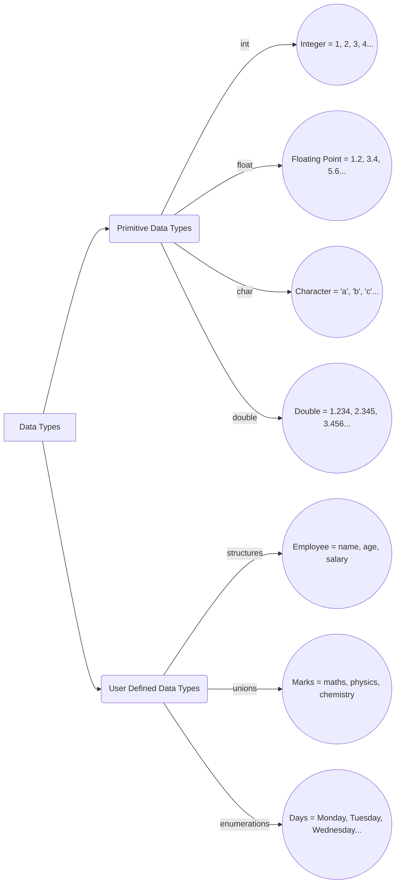

# Data Structures

## Data types

There are two types of data types in C:
1. Primitive data types (int, float, char, double, etc.)
2. User defined data types (structures, unions, enumerations)



## Structures
A structure is a user-defined data type in C that groups together related data of different data types. It allows us to create a more complex data type that can be used to represent a real-world entity.

### Structure Declaration
The general syntax for declaring a structure is:

```c
struct structureName {
    dataType member1;
    dataType member2;
    ...
    dataType memberN;
};
```

Example:

```c
#include <stdio.h>

struct CSD{ // Abstract Structure
    int id;
    char grade;  // char grade = 'A'; will give error
    double percentage;
};

int main(){
    ....
}
```

> - We cannot declare the values of the structure in the structure declaration.  
> - We can only declare the structure in the structure declaration.  
> - To declare the values of the structure, we need to create variables of that structure type.

**Abstraction**: Displaying only essential information and hiding the details.

**Encapsulation**: Putting group of data together and hiding that information by using access modifiers.
<br>
<br>


Providing values to the structure:

```c
#include <stdio.h>

struct CSD{ // Abstract Structure
    int id;
    char grade;  // char grade = 'A'; will give error
    double percentage;
};

struct CSD setStudent(int i, char g, double p){
    struct CSD o;   // Creating an object of structure type
    o.id = i;
    o.grade = g;
    o.percentage = p;
    return o;
};

void printStudent(struct CSD o){
    printf("ID: %d\n", o.id);
    printf("Grade: %c\n", o.grade);
    printf("Percentage: %lf\n", o.percentage);
}

int main(){
    struct CSD std1, std2; // Creating variables of structure type
    std1 = setStudent(23, 'A', 99.8);
    std2 = setStudent(24, 'B', 88.9);
    printStudent(std1);
    printStudent(std2);
    return 0;
}
```

#### Lecturer's code:

```c
#include <stdio.h>
//abstraction
struct CSD{// abstract structure
    int id; char grade; double per;
};
struct CSD setStudent(int i, char g, double p)
{ struct CSD o; o.id=i;  o.grade = g; o.per = p; return o; }
void printStudent(struct CSD o)
{ printf("ID: %d Grade: %c Percentage: %lf\n", o.id, o.grade, o.per); }
int main(){
    struct CSD std1, std2;
    std1 = setStudent(523, 'A', 99.8);
    std2 = setStudent(568, 'B', 88.9);
    printStudent(std1); printStudent(std2);
}
```

Smaller code:

```c
#include <stdio.h>

struct CSD{ // Abstract Structure
    int id;
    char grade;
    double percentage;
};

int main(){
    struct CSD std1, std2;
    std1.grade = 'A';
    printf("Grade: %c\n", std2.grade);  // Doesn't give error but gives garbage value
    // assiginig values to the structure 1 doesn't affect the structure 2
    return 0;
}
```


### Strucure Rules

1. We cannot perform initialization within the structure declaration.
2. Each object has its own state and behavior.
3. An object created within structure defaults to 0, else to garbage.
   
```c
#include <stdio.h>

struct CSD{ // Abstract Structure
    int id;
    char grade;
    double percentage;
}std1, std2; // Creating variables/Objects of structure type

int main(){
    std1.id = 90;
    printf("%d", std2.id);
}
```
> OUTPUT:
```
 0
```

Object created within structure declaration defaults to 0.  
Char will be deafulted to space.

- It is preferable to declare the structure outside the main function.

### Structure Array

```c
#include <stdio.h>
#include <string.h>

struct CSD{
    int id;
    char grade;
    double percentage;
};

struct CSD setStudent(int i, char g, double p){
    struct CSD o;
    o.id = i;
    o.grade = g;
    o.percentage = p;
    return o;
};

void printStudent(struct CSD o){
    printf("ID: %d\n", o.id);
    printf("Grade: %c\n", o.grade);
    printf("Percentage: %lf\n", o.percentage);
}

int main(){
    int n, i;
    printf("Enter the number of students: ");
    scanf("%d", &n);
    struct CSD std[n];
    for(i = 0; i < n; i++){
        printf("Enter %d student's ID, Grade, Percentage: ", i);
        scanf("%d %c %lf", &std[i].id, &std[i].grade, &std[i].percentage);
    }
    puts("Student Details: \n");
    for(i = 0; i < n; i++){
        printStudent(std[i]);
        printf("\n");
    }
    return 0;
}
```
> *OUTPUT*:
```
Enter the number of students: 2
Enter 0 student's ID, Grade, Percentage: 123 A 96
Enter 1 student's ID, Grade, Percentage: 321 Z 0.0002
Student Details:

ID: 123
Grade: A
Percentage: 96.000000

ID: 321
Grade: Z
Percentage: 0.000200
```

## Unions
A union is a user-defined data type that allows storing different data types in the same memory location. Only one member of the union can be accessed at a time.

### Union Properties

- A union can have multiple members, but only one member can contain a value at any given time.
- If the value of one member is changed, then the values of all other members will be changed.
- All members of a union share the same memory location.

### Union Declaration

The general syntax for declaring a union is:

```c
union unionName {
    dataType member1;
    dataType member2;
    ...
    dataType memberN;
};
```

Example:

```c
#include <stdio.h>
// Union Declaration
union CSD{
    int year1, year2, year3;
    // int year1 = 2000; will give error
    // Union is also an abstract data type like structure
}std1;

int main(){
    std1.year1 = 2024;
    printf("%d", std1.year2);  // Gives output 2024

    std1.year1 = 2024;
    std1.year3 = 2025;
    printf("%d %d %d", std1.year1, std1.year2, std1.year3);  
    // Gives output 2025 2025 2025
    return 0;
}
```
> All variables in CSD share the same address

<b>*OUTPUT*</b>:
```
2024
2025 2025 2025
```

### Union Rules

1. We cannot perform initialization within the union declaration.
2. All variables in a union share the same address.


## Enumerations

An enumeration is a user-defined data type that consists of integral constants. To define an enumeration, keyword enum is used.

### Enumeration Declaration
The basic syntax for declaring an enumeration is:

```c
enum enumName {
    constant1,
    constant2,
    ...
    constantN;
};
```

Example:
    
```c
#include <stdio.h>
// Enumerations
enum week{
    Monday,
    Tuesday,
    Wednesday,
    Thursday,
    Friday,
    Saturday,
    Sunday
};
// week ⇒ enumeration
// monday, tuesday ⇒ enumerators
// monday = 0, tuesday = 1 ⇒ values
int main(){
    enum week today;
    today = Wednesday;
    printf("Day %d", today+1);
    return 0;
}
```

> *OUTPUT*:
```
Day 3
```

If value of enum is predefined, then we can use it directly.

```c
#include <stdio.h>

enum week{
    Monday = 90, Tuesday
};

int main(){
    printf("%d %d", Monday, Tuesday);
    return 0;
}
```

> *OUTPUT*:
```
90 91
```

The value next to the previous value is automatically incremented by 1.

- Once the value of an enumerator is defined, it cannot be changed.
- If we don't assign values to enum names, then they are automatically assigned values starting from 0.

### Enumeration Rules

1. Object is not required to access the enum values.
2. First enum value is assigned 0, and then the next value is incremented by 1 by default.
3. If we don't assign values to enum names, then they are automatically assigned values starting from 0.
4. An enumerator's value is previous enumerator's value + 1.
5. Enumerators can be initialized to values of any integer type but cannot be changed outside the enum declaration. Enumerators are CONSTANTS.


## Insertion Before Algorithm

insertBefore(k1, k2) ⇒ Insert k2 before k1

1. If list is empty, Do nothing
2. If k1 is the head, push(k2)
3. Search for Node before k1(p)
    3a. If k1 does not exist ⇒ Do nothing
    3b1. Create a node, insert a value k2
    3b2. n next is k1(p→next)
    3b3. p next is n

## Insertion After Algorithm

insertAfter(k1, k2) ⇒ Insert k2 after k1

1. If list is empty, Do nothing
2. If k1 is the tail, append(k2)
3. Search for Node k1(p)
    3a. If k1 does not exist ⇒ Do nothing
    3b1. Create a node, insert a value k2
    3b2. n next is k1(p→next)
    3b3. p next is n

## Deletion Algorithm

1. If list is empty, Do nothing.
2. If head is N ⇒ head's next is new head.
3. If N is both head and tail ⇒ head and tail is NULL.
4. Search for N's previous node (p)  
    4a. If N does not exist ⇒ Do nothing.  
    4b. If p next is Tail ⇒ make p as new tail.  
    4c. If N is present, p's next is p's next's next.