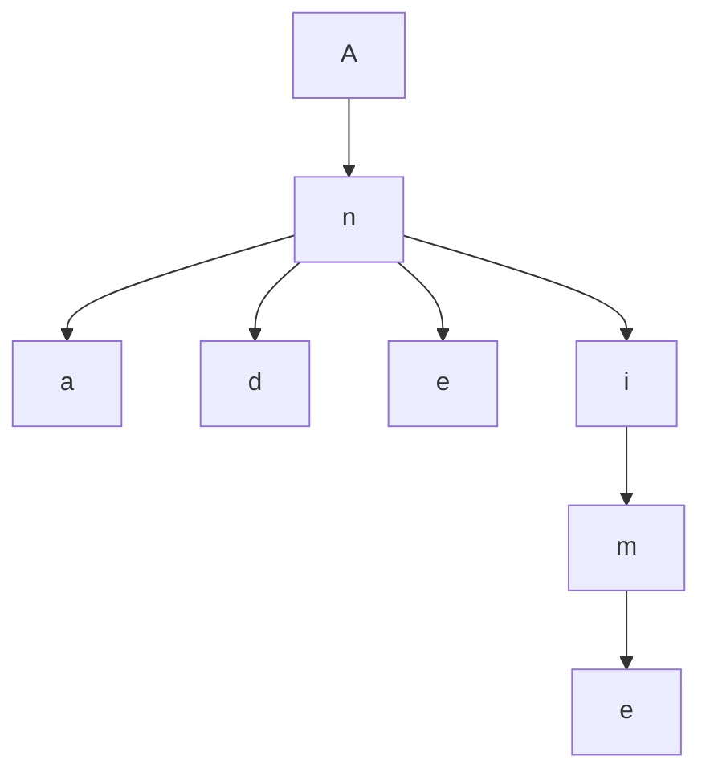
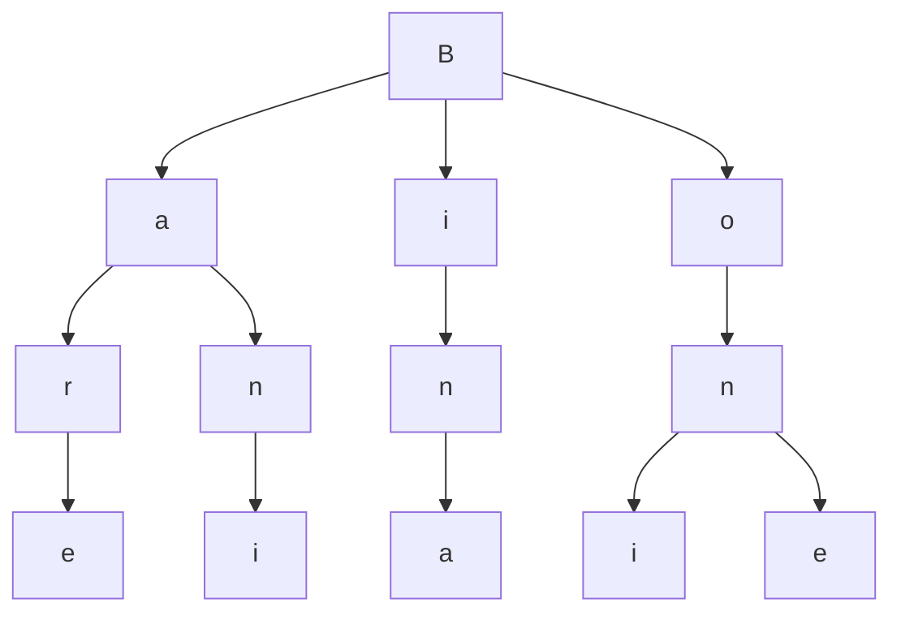

# Tries

Trie is a data structure that stores strings in a tree-like structure. It is used to store a dynamic set where the keys are usually strings. It is used to store strings that can be visualized as a tree. Each node in the tree represents a string. The root node represents an empty string. The children of a node are the strings that can be formed by adding one more character to the string represented by the node. The string is formed by traversing from the root to the node. The string is formed by concatenating the characters in the path from the root to the node.

**Example:**

"And", "Ani", "Ane", "Anime", "Ana", "And"



"Bar", "Bare", "Bin", "Bone", "Bina", "Bani", "Boni"



```java
import java.util.*;
import java.math.*;

class Trie {
    Node root;
    class Node{
        int c;
        Node array[];
        
        Node(){
            array = new Node[26];
        }
    }

    Trie(){
        root = new Node();
    }
    
    void insert(String s){
        Node tmp = root;
        int n = s.length();
        for(int i=0; i<n; i++){
            int ind = (int) n = s.length();
            if(tmp.array[ind] == null)
                tmp.array[ind] = new Node();
            tmp = tmp.array[ind];
        }
        tmp.c++;
    }

    boolean search(String s){
        Node tmp = root;
        int n = s.length();
        for(int i=0; i<n; i++){
            int ind = (int) n = s.length();
            if(tmp.array[ind] == null)
                return false;
            tmp = tmp.array[ind];
        }
        // return true; // ==> Will check if prefic exixts
        return tmp.c > 0; // ==> Will check if the exact word exists
    }
}

class Main {
    public static void main(String arhs[]){
        Trie t = new Trie();
        t.insert("ban");
        t.insert("bane");
        System.out.println(t.search("ban"));
    }
}
```

**Find the Longest String**

- Given an array of strings arr[]. You have to find the longest string which is lexicographically smallest and also all of its prefix strings are already present in the array.

```java
class Trie {
    Node root;
    class Node{
        int c;
        Node array[];
        
        Node(){
            array = new Node[26];
        }
    }

    Trie(){
        root = new Node();
    }
    
    void insert(String s){
        Node tmp = root;
        int n = s.length();
        for(int i=0; i<n; i++){
            int ind = (int) s.charAt(i) - 97;
            if(tmp.array[ind] == null)
                tmp.array[ind] = new Node();
            tmp = tmp.array[ind];
        }
        tmp.c++;
    }
    
    String dfs(){
        return dfs2(root, "");
    }
    
    String dfs2(Node n, String str){
        String max = str;
        for(int i=0; i<26; i++){
            if(n.array[i] != null && n.array[i].c > 0){
                int ind = i + 97;
                String tmp = dfs2(n.array[i], str+(char)ind);
                if( tmp.compareTo(max) == -1 || tmp.length() > max.length())
                    max = tmp;
            }
        }
        return max;
    }
}

class Solution {
    public static String longestString(int n, String[] arr) {
        Trie t = new Trie();
        for(String i:arr)
            t.insert(i);
        return t.dfs();
    }
}
```