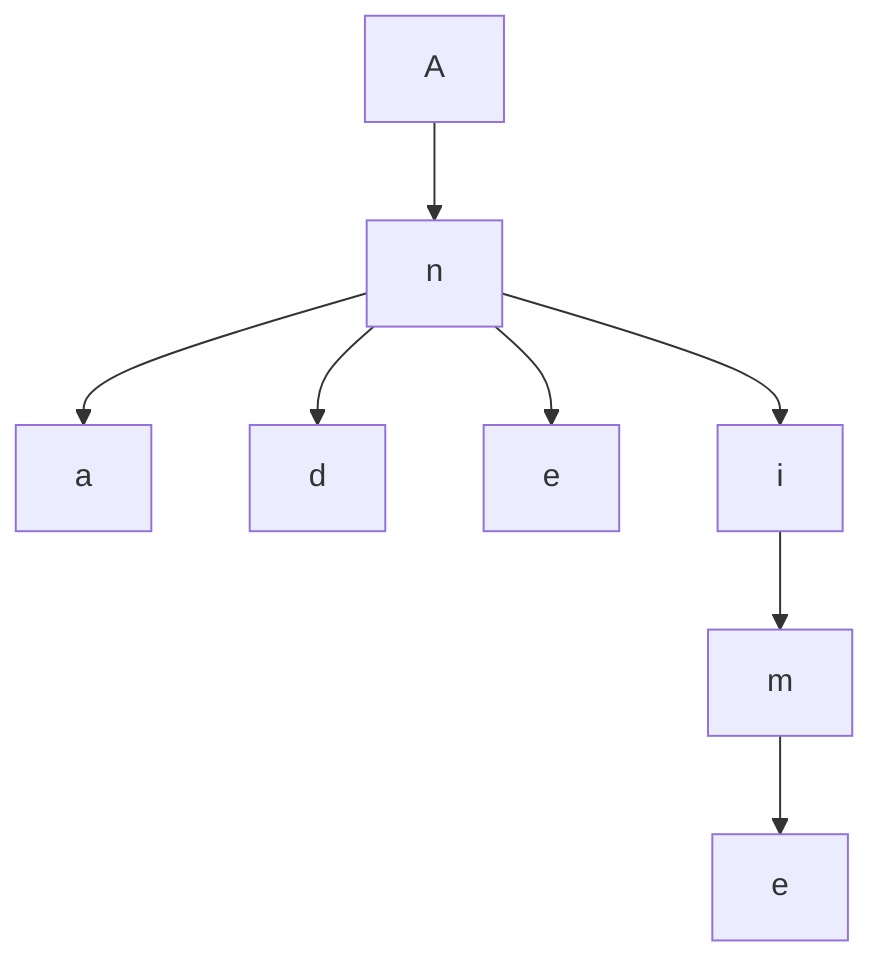

# Tries

Trie is a data structure that stores strings in a tree-like structure. It is used to store a dynamic set where the keys are usually strings. It is used to store strings that can be visualized as a tree. Each node in the tree represents a string. The root node represents an empty string. The children of a node are the strings that can be formed by adding one more character to the string represented by the node. The string is formed by traversing from the root to the node. The string is formed by concatenating the characters in the path from the root to the node.

**Example:**

"And", "Ani", "Ane", "Anime", "Ana", "And"



"Bar", "Bare", "Bin", "Bone", "Bina", "Bani", "Boni"

```mermaid
grapg TD
    A --> n
    n --> a
    n --> d
```